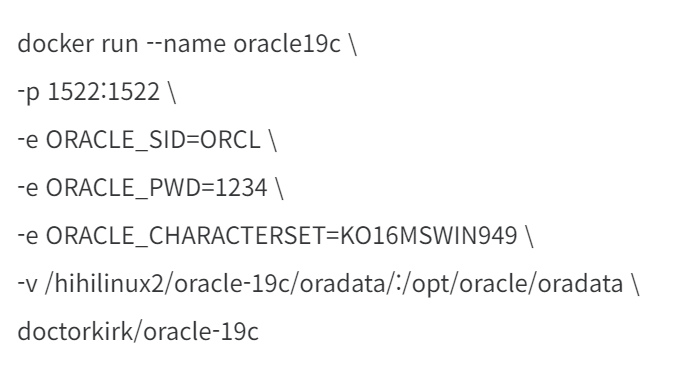

```ts
  @BeforeInsert()
  insertCreated() {
    this.created_at = new Date(
      moment().tz("America/Sao_Paulo").format("YYYY-MM-DD HH:mm:ss")
    );
    this.updated_at = new Date(
      moment().tz("America/Sao_Paulo").format("YYYY-MM-DD HH:mm:ss")
    );
  }

  @BeforeUpdate()
  insertUpdated() {
    this.updated_at = new Date(
      moment().tz("America/Sao_Paulo").format("YYYY-MM-DD HH:mm:ss")
    );
  }
```


docker run --name oracle19c
-p 1521:1521
-e ORACLE_SID=ORCL
-e ORACLE_PWD=ppdm12
-e ORACLE_CHARACTERSET=KO16MSWIN949
-v D:\dev\global\oradata:/opt/oracle/oradata/doctorkirk/oracle-19c